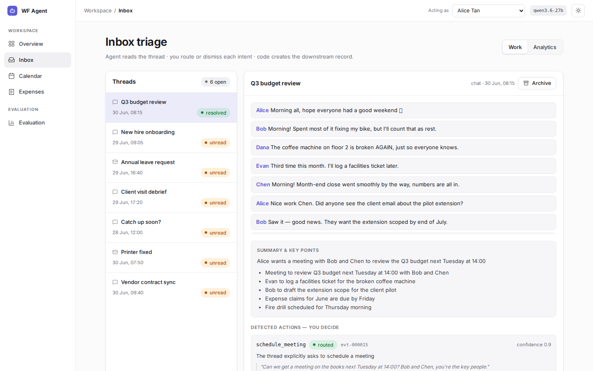
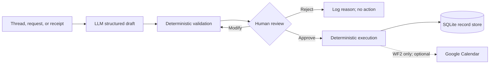

# Administrative Agent

> A human-in-the-loop LLM workflow system for inbox triage, conflict-aware scheduling,
> and evidence-first expense review.

[](https://www.python.org/)
[](https://fastapi.tiangolo.com/)
[](https://react.dev/)
[](https://github.com/WeiboShang/agent-administrative/actions/workflows/ci.yml)
[](#safety-and-scope)

Administrative Agent is a research prototype that tests a specific approach to workplace
AI:

**the model proposes, deterministic code validates, a human decides, and only then does the
system execute.**

The repository implements and evaluates reviewable administrative workflows. It keeps
workflow state, approval decisions, audit records, and the evidence needed for an offline
replay.



## What it does

| Workflow | Unstructured input | Reviewable output | Controlled side effect |
|---|---|---|---|
| **WF1: Inbox triage** | Multi-party chat or email thread | Source-grounded meeting and expense drafts | Routes drafts only; never books or approves |
| **WF2: Scheduling** | Natural-language meeting request | Resolved participants, time, room, conflicts, and alternatives | Creates a local event and `.ics`; optional Google Calendar sync after approval |
| **WF3: Expense review** | Receipt image | Extracted claim, evidence comparison, policy and duplicate checks | Separate employee submission and approver decision |

The application includes a stateful workspace, a React interface, a FastAPI backend, and an
evaluation workbench for inspecting cases, matched baselines, run history, and human-review
results.

## Why this project exists

Administrative requests look simple until a system must decide what *not* to do. A casual
message can resemble a meeting request; a date can be ambiguous; an available room can still
conflict with the organiser; and a plausible receipt extraction can contain a consequential
digit error.

This project investigates three questions:

1. Can an LLM reliably turn unstructured workplace communication into structured drafts?
2. Which failures should be handled by models, deterministic controls, or human review?
3. Does a human approval gate improve outcomes without becoming a rubber stamp?

### Problems studied and controls implemented

| Observed problem | Implemented control |
|---|---|
| Social, hypothetical, cancelled, or FYI text is over-detected as actionable | Source-message grounding, abstention rules, retraction checks, and draft-only routing |
| Natural-language dates and rooms create hidden scheduling errors | Deterministic date resolution, canonical resource IDs, organiser-aware conflict checks, and revalidation before mutation |
| Receipt OCR can be internally plausible but wrong | Immutable image evidence, a second critical-field read, cross-read reconciliation, and evidence-visible review |
| Policy decisions drift when delegated to a model | Deterministic limits, arithmetic, currency conversion, duplicate checks, and lifecycle validation |
| One-click approval can hide role conflicts | Separate employee and approver transitions; self-approval is blocked |
| Evaluation can leak gold labels or silently change state | Frozen model outputs, gold-free execution envelopes, isolated in-memory stores, and append-only formal records |

## System design



All workflow state changes pass through backend interfaces. Tests and formal evaluation
inject mock backends and isolated stores; they cannot reach Google Calendar. The optional
calendar integration uses a dedicated project account, creates no attendee invitations, and
runs only after human approval.

## Evaluation snapshot

The final automated comparison contains 223 synthetic cases, executed once through a
baseline condition and once through the controlled workflow (446 executions). The numbers
apply to this fixed, bounded suite. They are not production reliability claims.

| Workflow | Baseline task outcome | Controlled task outcome | Baseline unsafe outcome | Controlled unsafe outcome |
|---|---:|---:|---:|---:|
| WF1: triage | 46.7% | **86.7%** | 40.0% | **6.7%** |
| WF2: scheduling | 70.0% | **100.0%** | 15.7% | **0.0%** |
| WF3: expense | 70.4% | **88.9%** | 8.3% | **3.7%** |

The controlled human study contains one reviewer and 36 formal cases. It is reported as
descriptive evidence: agent assistance reduced median active review time and interactions,
but did not improve aggregate decision correctness. See
[`docs/results.md`](docs/results.md) for confidence intervals, protocol versions, failure
analysis, and limitations; see [`docs/evaluation.md`](docs/evaluation.md) for metric and
scoring definitions.

## Quick start

### Prerequisites

- Python 3.11
- [`uv`](https://docs.astral.sh/uv/) for the Python environment
- A Groq API key for live LLM and receipt extraction
- Node.js 20+ only if you want to rebuild or develop the frontend

### Run the application

```bash
git clone https://github.com/WeiboShang/agent-administrative.git
cd agent-administrative

uv venv --python 3.11
uv pip install --python .venv/bin/python -r requirements.txt

cp .env.example .env
# Edit .env and set GROQ_API_KEY. Keep CALENDAR_BACKEND=mock for the local demo.

.venv/bin/uvicorn backend.main:app --host 127.0.0.1 --port 8000
```

Open:

- Application: <http://127.0.0.1:8000>
- Interactive API documentation: <http://127.0.0.1:8000/docs>
- Health check: <http://127.0.0.1:8000/health>

The first run seeds a fictional organisation and sample records into
`data/workspace.db`. To run without persistent local state, set
`RECORD_STORE_PATH=:memory:` in `.env`.

### Reset the demo workspace

Stop the server, then run:

```bash
PYTHONPATH=. .venv/bin/python -m backend.scripts.reset_workspace
```

## Reproduce the reported evidence

There are two different reproduction boundaries. The offline path verifies the published
evidence without calling a model. Live reruns consume third-party API quota and may differ
when providers or hosted models change.

### 1. Verify the frozen final evidence offline

No API key or Google credentials are required:

```bash
PYTHONPATH=. .venv/bin/python -m backend.scripts.materialize_evaluation_receipts
PYTHONPATH=. .venv/bin/python -m backend.evals.final_part_a
```

The first command rebuilds the gitignored synthetic receipt PNGs and checks their hashes.
The second reconstructs the declared **Part A Final** boundary from versioned datasets,
frozen model outputs, and deterministic scorers. Neither command calls a model or overwrites
a formal result row.

Expected controlled-condition counts:

```text
WF1  39 / 45 task outcomes, 3 / 45 unsafe outcomes
WF2  70 / 70 task outcomes, 0 / 70 unsafe outcomes
WF3  96 / 108 task outcomes, 4 / 108 unsafe outcomes
```

### 2. Verify the build

```bash
# Backend: isolated in-memory state; no API key required
PYTHONPATH=. .venv/bin/python -m backend.scripts.materialize_evaluation_receipts
PYTHONPATH=. .venv/bin/python -m pytest backend -q --import-mode=importlib
.venv/bin/ruff check backend

# Frontend
cd frontend-next
npm ci
npx tsc --noEmit
npm run build
```

### 3. Run live model evaluations (optional)

After setting `GROQ_API_KEY`, individual live harnesses can be run with:

```bash
PYTHONPATH=. .venv/bin/python -m backend.evals.run_scheduling_eval
PYTHONPATH=. .venv/bin/python -m backend.evals.run_receipt_eval <receipt-directory> <count>
```

Read [`docs/evaluation.md`](docs/evaluation.md) before running or interpreting a live
evaluation. Formal rows are immutable, historical models may no longer be available, and
the repository keeps reruns separate from the frozen evidence used for the reported results.

## Optional Google Calendar setup

The repository defaults to the mock calendar. For the bounded interactive WF2 integration,
follow [`docs/google_calendar_setup.md`](docs/google_calendar_setup.md), use a dedicated
throwaway project account, and keep every credential under the gitignored `secrets/`
directory. Real people and real attendee email addresses are outside this project's scope.

## Repository map

```text
backend/
  agent/        LLM extraction, receipt vision, prompts, and normalisation
  workflows/    deterministic triage, scheduling, expense, policy, and content logic
  backends/     SQLite record store and calendar/directory abstractions
  routers/      FastAPI endpoints and approval transitions
  evals/        datasets, frozen-output replays, scorers, and evaluation runners
frontend-next/  React 19 + TypeScript application; FastAPI serves the built SPA
data/           synthetic fixtures, frozen evaluation inputs, outputs, and manifests
docs/           workflow rationale, evaluation protocol, results, and setup guides
```

Start with [`docs/workflow_design.md`](docs/workflow_design.md) for the integrated design,
[`docs/evaluation.md`](docs/evaluation.md) for the research protocol, and
[`docs/results.md`](docs/results.md) for the evidence and validity boundaries.

## Safety and scope

- **Synthetic core data.** The application and formal matched evaluation use fictional
  people and records. Separate external-validity diagnostics use public research datasets.
- **No real operational data.** The application is not approved for employee, customer, or
  financial records from a real organisation.
- **Human approval before side effects.** The LLM never receives final business authority.
- **Mock-only evaluation.** Formal evaluation cannot invoke an external calendar backend.
- **Research prototype.** Authentication, multi-tenant isolation, production observability,
  deployment hardening, and enterprise compliance are intentionally out of scope.

Known technical limitations include ambiguous-intent over-detection, degraded receipt-image
errors, one-reviewer human evidence, synthetic-suite bias, and reliance on hosted models for
live extraction. The full discussion is maintained in [`docs/results.md`](docs/results.md).

## Attribution

The external-method comparison adapts loop semantics from the MIT-licensed
[WorkBench](https://github.com/olly-styles/WorkBench) project at pinned commit
`49c7dfd00c03d384ec59ea57374f50b766aa5613`. Its licence notice is retained in
[`docs/licenses/WORKBENCH-MIT.txt`](docs/licenses/WORKBENCH-MIT.txt).

The optional external-validity scripts use CORD and QMSum/AMI research data. Raw receipt
images and meeting transcripts are downloaded at run time and excluded from Git. See
[`THIRD_PARTY_NOTICES.md`](THIRD_PARTY_NOTICES.md) for licences and citations.

## Licence

This project is released under the [MIT License](LICENSE). Third-party datasets and the
WorkBench-derived comparison retain their own licences and attribution requirements; see
[`THIRD_PARTY_NOTICES.md`](THIRD_PARTY_NOTICES.md).
